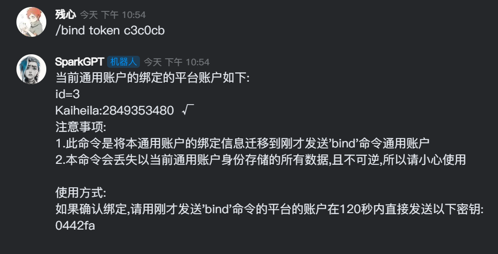

<div align="center">
  <a href="https://github.com/canxin121">
    
  </a>
  <h1>nonebot_plugin_bind</h1>
</div>

<p align="center">
    <a href="https://pypi.python.org/pypi/nonebot-plugin-bind">
    
    </a>
    
    
    <br />
    <a href="https://github.com/canxin121/nonebot_plugin_bind/releases/">
    <a href="https://img.shields.io/github/last-commit/canxin121/nonebot_plugin_bind">
    </a>
</p>
<div align="left">

# 使用说明

## 用户使用说明

| 命令                  | 限制    | 含义       |
|---------------------|-------|----------|
| 'bind' 或 '绑定'       | 群聊或私聊 | 发起绑定事件   |
| 'bindinfo' 或 '绑定信息' | 仅私聊   | 查看账户绑定信息 |

具体使用请看下图流程示例  
  
  
  

## 开发者说明
使用依赖注入获取用户信息的示例

```python
from typing import Annotated

from nonebot import require
require('nonebot_plugin_bind')

from nonebot_plugin_bind import GetUser

_bind_info_ = on_command("bindinfo", aliases={"绑定信息"})


@_bind_info_.handle()
async def __(event: Event, bot: Bot, matcher: Matcher, user: Annotated[User, GetUser()]):
    # 这里获取到的user可以访问属性来获取用户的具体账户信息,其中user.id是每个跨平台用户的唯一索引,也可以使用str()方法来转化成字符串
    if _is_private_(event, bot):
        await matcher.finish(f"当前账户的绑定信息如下:\n{str(user)}")
    else:
        await matcher.finish("账户绑定信息只能在私聊中查看")

```
